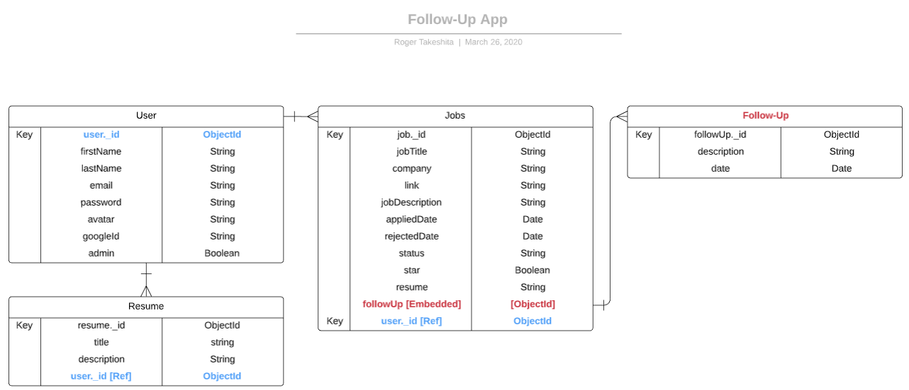

<h1 id='summary'>Summary</h1>

* [Follow-Up App](#followup)
  * [Back-end Node.js](#basic)
    * [Installation](#installation)
    * [Basic Server Structure](#serverstructure)
    * [Basic Server](#baiscserver)
    * [dotenv File](#dotenv)
    * [Database](#database)
      * [Database - Create Folder/Files](#createfoldersdata)
      * [User Schema](#userschema)
      * [Config Database Connection](#configdatabase)
      * [Connect Database to the Server](#connectdatabase)
    * [Config JWT Auth](#configauth)
      * [JWT Auth File](#jwtauth)
      * [Add JWT to User Schema](#addjwtuser)
      * [Config Users Controllers with JWT](#usercontroller)
    * [Routes](#routes)
      * [Create Routes Folders/Files](#createfolderroutes)
      * [User Routes](#usersroute)
      * [Request Routes](#requestsroute)
      * [Application Controller](#controllersapplications)
      * [Add API Routes to the Server](#serverapis)
    * [Server Structure](#serverstructure1)
  * [Front-End React](#frontend)
    * [Index.html](#index)
      * [CSS Family Fonts](#fonts)
  * [Redux](#redux)
    * [Redux Folder/Files](#reduxfiles)
    * [Redux - User](#reduxuser)
    * [Store](#store)
  * [index.js](#indexjs1)
  * [API Folder](#apiutils)
    * [API Folders/Files](#folderfilesapi)
    * [tokenService.js](#apitoken)
    * [userService.js](#apiuser)
    * [apiService.js](#apiservice)
  * [Redux - User [UPDATE]](#updateredux)
  * [Components](#components)
    * [FormLogin.jsx](#formlogin)
    * [FormSignup.jsx](#formsignup)
    * [Navbar.jsx](#navbar)
  * [Pages](#pages)
    * [HomePage.js](#homepage)
    * [LoginPage.js](#loginpage)
    * [NewApplicationPage.js](#newpage)
    * [SignupPage.js](#signuppage)
  * [CSS Folder](#css)
  * [App.js](#app)
  * [Front-End Structure](#appstructure)
* [Project Database](#projectdatabase)

<h1 id='followup'>Follow-Up App</h1>

<h2 id='basic'>Basic Back-End</h2>

<h3 id='installation'>Installation</h3>

[Go Back to Summary](#summary)

```Bash
    npx create-react-app follow-up-app
    npm i redux react-redux redux-saga
    npm i express morgan serve-favicon mongoose dotenv bcrypt jsonwebtoken react-router-dom
    npm i @material-ui/core @material-ui/icons @material-ui/icons 
```
<h3 id='serverstructure'>Basic Server Structure</h3>

[Go Back to Summary](#summary)

* Initial Structure
  
    ```Bash
        .
        ├── node_modules
        ├── public
        │   ├── faicon.ico
        │   ├── index.html
        │   └── robots.txt
        ├── src
        │   ├── App.css
        │   ├── App.js
        │   ├── App.test.js
        │   ├── index.css
        │   ├── index.js
        │   ├── serviceWorker.js
        │   └── setupTests.js
        ├── .env
        ├── package-lock.json
        ├── package.json
        ├── Procfile
        └── server.js
    ```

<h3 id='baiscserver'>Basic Server</h3>

[Go Back to Summary](#summary)

* In `server.js`
  * Let's config the basic server:

    ```JavaScript
        const express = require('express');
        const path = require('path');                                       //! Used to figure out where I am going to serve my html from
        const favicon = require('serve-favicon');                           //! Just the website icon
        const logger = require('morgan');                                   //! Morgan is used for logging request details

        const app = express();                                                  //+ Create express app

        //! Middleware
        app.use(logger('dev'));                                                 //+ Mount my loggger middleware       
        app.use(express.json());                                                //+ Mount my json midleware - to response as JSON requests
                                                                                    //- For React back-end, we dont need method-override because we don't have any forms to submit
        app.set('view engine', 'ejs');                                          //+ Use .ejs as the default view engine
        //! Configure both serve-favicon & static middlewares to serve from the production 'build' folder
        app.use(favicon(path.join(__dirname, 'build', 'favicon.ico')));
        app.use(express.static(path.join(__dirname, 'build')));                 //+ looking for static assets, we are going to look into this folder (html file, css, image)
                                                                                    //- static files don't have any logic

        //! API Routes -  Put them before the "catch all" route - The following "catch all" route (note the *)is necessary for a SPA's client-side routing to properly work
        app.get('/*', function(req, res) {
            res.sendFile(path.join(__dirname, 'build', 'index.html'));
        });

        //! Configure to use port 3001 instead of 3000 during development to avoid collision with React's dev server
        const port = process.env.PORT || 3001;
        app.listen(port, function() {
            console.log(`Express app running on port ${port}`)
        });
    ```

<h3 id='dotenv'>dotenv File</h3>

[Go Back to Summary](#summary)

* In `.env`
  * Declare your secret variables

    ```JavaScript
        DATABASE_URL=mongodb://localhost/pennydb
        SECRET_JWT=roger-takeshita-secret
    ```
  * the `DATABASE_JWT` we're going to use to connect to our local database
  * the `SECRET_JWT` we're going to use later to encode/decode the token

<h3 id='database'>Database</h3>

[Go Back to Summary](#summary)

<h4 id='createfoldersdata'>Database - Create Folder/Files</h4>

```Bash
    touch models/user.js
    touch config/database.js
    touch config/auth.js
    touch controllers/users.js
    touch controllers/applications.js
```

<h4 id='userschema'>User Schema</h4>

* In `models/user.js`

    ```JavaScript
        const mongoose = require('mongoose');       //! Require mongoose
        const Schema = mongoose.Schema;             //! Shorthand for mongoose.schema (optional)

        //! User Schema
        const userSchema = new Schema(
            {
                firstName: {
                    type: String,
                    required: true
                },
                lastName: {
                    type: String,
                    required: true
                },
                email: {
                    type: String,
                    required: true
                },
                password: {
                    type: String,
                    required: true
                },
                admin: {
                    type: Boolean,
                    default: false
                },
                avatar: {
                    type: String
                },
                googleId: {
                    type: String
                }
            },
            {
                timestamps: true
            }
        );

        //! export mongoose module as User
        module.exports = mongoose.model('User', userSchema);
    ```

<h4 id='configdatabase'>Config Database Connection</h4>

* In `config/database.js`

    ```JavaScript
        const mongoose = require('mongoose');       //! Require mongoose
        const db = mongoose.connection;             //! Shorthand for mongoose.connection (optional)

        //! Connect to mongodb
        mongoose.connect(
            process.env.DATABASE_URL, { 
                useNewUrlParser: true, 
                useCreateIndex: true, 
                useUnifiedTopology: true 
            }
        );

        //! Check if it's connected
        db.once('connected', () => {
            console.log(`Connected to MongoDB ${db.name} at ${db.host}:${db.port}`);
        });
    ```

<h4 id='connectdatabase'>Connect Database to the Server</h4>

* In `server.js`
  * After `const logger = require ('morgan');` require first the dotenv file and after the database (because the database will need DATABASE_URL to connect)

    ```JavaScript
        const logger = require('morgan');                                   //! Morgan is used for logging request details
        require('dotenv').config();                                         //! Require dotenv module before the database, we need the dotenv path to load our database
        require('./config/database');                                       //! Require the database
    ```

<h3 id='configauth'>Config JWT Auth</h3>

[Go Back to Summary](#summary)

<h4 id='jwtauth'>JWT Auth File</h4>

* In `config/auth.js`
  * We are going to check if the token is valid - for every request

    ```JavaScript
        const jwt = require('jsonwebtoken');                                            //! Require jwt
        const SECRET = process.env.SECRET_JWT;                                          //! Get the encode/decode key

        module.exports = function(req, res, next) {
            let token = req.get('Authorization') || req.query.token || req.body.token;      //+ Get the token
            if (token) {                                                                    //+ If token exists
                token = token.replace('Baerer ', '');                                           //- Remove 'Baerer '
                jwt.verify(token, SECRET, function(err, decoded) {                              //- Decode the token
                    if (err) {                                                                      //? If error
                        next(err);                                                                      //> Call next() function
                    } else {                                                                        //? Else
                        req.user = decoded.user;                                                        //> If not error, orverride req.user with just the user information from token (in this case _id, firstName, lastName and email)
                        next();                                                                         //> Call next() function
                    }
                });
            } else {                                                                        //+ If token doesn't exist
                next();                                                                         //- Call next() function
            }
        };
    ```

<h4 id='addjwtuser'>Add JWT to User Schema</h4>

* In `models/user.js`
  * Let's Encrypt the password before saving and add a compare function to decrypt the password to check if it's valid
  * After `const Schema = mongoose.Schema;` add:
  
    ```JavaScript
        const Schema = mongoose.Schema;             //! Shorthand for mongoose.schema (optional)
        const bcrypt = require('bcrypt');           //! Require bycrypt
        const SALT_ROUNDS = 6;                      //! bcrypt has a setting that tells it how many times to randomize the generation of salt. Usually 6 is enough.
    ```

  * before `modules.export = mongoose.model('User', userScheam);` add:

    ```JavaScript
        //! Mongoose Middleware - Encrypt the password
        userSchema.pre('save', function(next) {                           //! pre middleware, also as known as 'hook'
            const user = this;                                                  //+ this will be set to the current user
            if (!user.isModified('password')) return next();                    //+ If the password hasn't changed, return call next() function
            bcrypt.hash(user.password, SALT_ROUNDS, function(err, hash) {       //+ If password has changed - salt and hash it. This is an async function, so we pass a function
                if (err) return next(err);                                          //- check if you got any error
                user.password = hash;                                               //- replace the user provided password with the hased password
                next();                                                             //- I need to call the next() function
            });
        });

        //! bcrypt includes a compare method for verifying that a cleartext password matches a given hash.
        userSchema.methods.comparePassword = function(tryPassword, cb) {
            bcrypt.compare(tryPassword, this.password, cb);
        };

        //! Remove the password property when serializing doc to JSON - In this case we are only sending back (_id, firstName, lastName, and email)
        userSchema.set('toJSON', {
            transform: function(doc, ret) {
                delete ret.password;
                delete ret.createdAt;
                delete ret.updatedAt;
                delete ret.admin;
                return ret;
            }
        });
    ```

<h4 id='usercontroller'>Config Users Controllers with JWT</h4>

* In `controllers/users.js` add:
  
    ```JavaScript
        const User = require('../models/user');                         //! Require the userl model
        const jwt = require('jsonwebtoken');                            //! Require JWT
        const SECRET = process.env.SECRET_JWT;                          //! Require the secret key

        function createJWT(user) {                                      //! Create a JWT Token valid for 24 for this specific user
            return jwt.sign({ user }, SECRET, { expiresIn: '24h' });
        }

        async function signup(req, res) {                                       //! Async Sign Up
            try {                                                                   //+ try/catch checks if the user already exists
                const user = await User.findOne({ email: req.body.email });             //- Find one user by email
                if (!user) {                                                            //- If user not found
                    const newUser = new User(req.body);                                     //? Create a new user object
                    try {                                                                   //? try/catch saves the new user
                        await newUser.save();                                                   //> Await for saving
                        const token = createJWT(newUser);                                       //> Create a new Token
                        res.json({ token });                                                    //> Response token to the sign up request
                    } catch (err) {                                                         //? If error
                        console.log(err);                                                       //> print
                        res.status(500).json({ err: 'Something went wrong' });                  //> Response error (500) - Internal error
                    }
                } else {                                                                //- If user exists
                    res.status(400).json({ err: 'Email already taken' });                   //? Response error (400) - Email already exists
                }
            } catch (err) {                                                         //+ If error
                res.status(500).json({ err: 'Something went wrong' });                  //- Response error(500) - Internal error
            }
        }

        async function login(req, res) {                                                //! Async Log In
            try {                                                                           //+ try/catch find one user
                const user = await User.findOne({ email: req.body.email });                     //- Find one user by email
                if (!user) return res.status(404).json({ err: "User doesn't exist!" });         //- If user doesn't exist, response error (404) - User doesn't exist
                user.comparePassword(req.body.password, (err, isMatch) => {                     //- If user exists, check the password with comparePassowrd function from User Schema
                    if (isMatch) {                                                                  //? If password match  
                        const token = createJWT(user);                                                  //> Create a new token
                        res.json({ token });                                                            //> Response the Token
                    } else {                                                                        //? If password doesn't match
                        return res.status(400).json({ err: 'Wrong password!' });                        //> Response error (400) - Wrong password
                    }
                });
            } catch (err) {                                                                 //+ If error
                res.status(500).json({ err: 'Something went wrong' });                          //- Response error (500) - Internal error
            }
        }

        module.exports = {
            signup,
            login
        };
    ```

<h3 id='routes'>Routes</h3>

[Go Back to Summary](#summary)

<h4 id='createfolderroutes'>Create Routes Folders/Files</h4>

```Bash
    touch routes/requests.js
    touch routes/users.js
```

  * `routes/users.js` we are going to use only for login/signup requests - dont need token
  * `routes/request.js` we are going to use this route for other requests - need token

<h4 id='usersroute'>User Routes</h4>

* In `routes/users.js` add:

    ```JavaScript
        const express = require('express');                     //! Require express
        const router = express.Router();                        //! Shorthand for exprss.Router() (optional)
        const usersCtrl = require('../controllers/users');      //! Require users controller

        //! Public routes
        router.post('/signup', usersCtrl.signup);                   //+ Sign up
        router.post('/login', usersCtrl.login);                     //+ Log In - Obs: we don't need a route for log out. We can simply delete the token from the localStorage (client side) - this way the client won't be authenticated anymore

        module.exports = router;
    ```

<h4 id='requestsroute'>Request Routes</h4>

* In `routes/requests.js` add:

    ```JavaScript
        const express = require('express');                                 //! Require express
        const router = express.Router();                                    //! Shorthand for express.Router() (optional)
        const applicationCtrl = require('../controllers/applications');     //! Require tue application controller

        //! Privet Routes
        router.use(require('../config/auth'));                              //! Request req.user
        router.get('/search/*', checkAuth, applicationCtrl.search);         //! Search for applications

        function checkAuth(req, res, next) {                                //! Helper function (middleware)
            if (req.user) return next();                                        //+ If user exist, call next() function
            return res.status(401).json({ msg: 'Not Authorized' });             //+ It user doesn't exist, reponse erro (401) - Not authorized
        }

        module.exports = router;
    ```

<h4 id='controllersapplications'>Application Controller</h4>

* In `controllers/applications.js` add:

  * Create a simple async function just to reponse the request

    ```JavaScript
        async function search(req, res) {
            try {
                //mongo query
                console.log(req.params[0]);
                //response
                res.json('ok');
            } catch (err) {
                console.log(err);
                res.json(err);
            }
        }

        module.exports = {
            search
        };
    ```

<h4 id='serverapis'>Add API Routes to the Server</h4>

* In `server.js`
  * Add the new routes (requests and users) before the catch all route

    ```JavaScript
        //! Put API routes here, before the "catch all" route
        app.use('/api/users', require('./routes/api/users'));
        app.use('/api/', require('./routes/api/requests'));

        //! API Routes -  Put them before the "catch all" route - The following "catch all" route (note the *)is necessary for a SPA's client-side routing to properly work
        app.get('/*', function(req, res) {
            res.sendFile(path.join(__dirname, 'build', 'index.html'));
        });
    ```

<h3 id='serverstructure1'>Server Structure</h3>

[Go Back to Summary](#summary)

```Bash
    .
    ├── config
    │   ├── auth.js
    │   └── database.js
    ├── controllers
    │   ├── applications.js
    │   └── users.js
    ├── models
    │   └── user.js
    ├── node_modules
    ├── public
    │   ├── favicon.ico
    │   ├── index.html
    │   └── robots.txt
    ├── routes
    │   ├── requests.js
    │   └── users.js
    ├── src
    │   ├── App.css
    │   ├── App.js
    │   ├── App.test.js
    │   ├── index.css
    │   ├── index.js
    │   ├── serviceWorker.js
    │   └── setupTests.js
    ├── .env
    ├── package-lock.json
    ├── package.json
    ├── Procfile
    └── server.js
```

<h2 id='frontend'>Front-End React</h2>

<h3 id='index'>Index.html</h3>

[Go Back to Summary](#summary)

<h4 id='fonts'>CSS Family Fonts</h4>

* Add to `public/index.html` file:

    ```html
        <link rel="stylesheet" href="https://fonts.googleapis.com/css?family=Roboto:300,400,500,700&display=swap" />
        <link rel="stylesheet" href="https://fonts.googleapis.com/icon?family=Material+Icons" />
    ```

<h3 id='redux'>Redux</h3>

[Go Back to Summary](#summary)

<h4 id='reduxfiles'>Redux Folder/Files</h4>

```Bash
    touch redux/user.js
    touch store.js
```
<h4 id='reduxuser'>Redux - User</h4>

* In `redux/user.js` add:

    ```JavaScript
        //! Constants
        const LOGIN_USER = 'LOGIN_USER';
        const LOGOUT_USER = 'LOGOUT_USER';
        const SIGNUP_USER = 'SIGNUP_USER';

        //! Actions
        export const loginUser = () => ({
            type: LOGIN_USER,
            payload: null
        });

        export const logoutUser = () => {
            // logout function
            return {
                type: LOGOUT_USER
            };
        };

        export const signupUser = () => ({
            type: SIGNUP_USER,
            payload: null
        });

        //! Reducers
        function userReducer(state = null, action) {
            switch (action.type) {
                case LOGIN_USER:
                    return action.payload;
                case LOGOUT_USER:
                    return null;
                case SIGNUP_USER:
                    return action.payload;
                default:
                    return state;
            }
        }

        //! Export reducer as default
        export default userReducer;
    ```

<h4 id='store'>Store</h4>

```JavaScript
    import { createStore, combineReducers, applyMiddleware } from 'redux';  //! Import createStore, combineReducer and applyMiddleware from redux
    import userReducer from './redux/user';                                 //! Import userReducer from user redux
    import logger from 'redux-logger';                                      //! Import redux-logger - A middleware to log each step on the console

    const reducers = combineReducers({                                          //+ combineReducers, here is where you combine multiple reducers into one object
        userReducer
    });

    const store = createStore(reducers, applyMiddleware(logger));               //+ createStore and applyMiddleware(logger) - logger in our case

    export default store;                                                       //+ Export default store
```

<h3 id='indexjs1'>index.js</h3>

[Go Back to Summary](#summary)

* Configure the react router and redux store (provider)
* in `src/index.js` add:

    ```JavaScript
        import React from 'react';
        import ReactDOM from 'react-dom';
        import './index.css';
        import App from './App';
        import * as serviceWorker from './serviceWorker';
        import { BrowserRouter as Router, Route } from 'react-router-dom';  //! Import BrowserRouter and Route
        import { Provider } from 'react-redux';                             //! Import redux Provider to connect the store
        import store from './store';                                        //! Import the store

        ReactDOM.render(
            <Provider store={store}>                                            //+ Wrap the main app and pass down the store 
                <Router>                                                            //- Wrapt the main app with Router component, so we can use different routers
                    <Route component={App} />                                           //? Router - render component App
                </Router>
            </Provider>,
            document.getElementById('root')
        );

        serviceWorker.unregister();
    ```

<h3 id='apiutils'>API Folder</h3>

[Go Back to Summary](#summary)

<h4 id='folderfilesapi'>API Folders/Files</h4>

```Bash
    touch utils/apiService.js
    touch utils/tokenService.js
    touch utils/userService.js
```
<h4 id='apitoken'>tokenService.js</h4>

```JavaScript
    //! Storing, retrieving and removing tokens from localStorage
    function setToken(token) {
        if (token) {
            localStorage.setItem('token', token);
        } else {
            localStorage.removeItem('token');
        }
    }

    //! Getting token and checking if it's still valid
    function getToken() {
        let token = localStorage.getItem('token');
        if (token) {
            //? atob() - decoding a base-64 encoded string. It is used to decode a string of data which has been encoded using the btoa() method.
            //? JSON.parse - Converting back a json object
            const payload = JSON.parse(atob(token.split('.')[1]));                             
            if (payload.exp < Date.now() / 1000) {
                localStorage.removeItem('token');
                token = null;
            }
        }
        return token;
    }

    //! Getting user from token
    function getUserFromToken() {
        const token = getToken();
        return token ? JSON.parse(atob(token.split('.')[1])).user : null;
    }

    //! Remove token
    function removeToken() {
        localStorage.removeItem('token');
    }

    export default {
        setToken,
        getToken,
        getUserFromToken,
        removeToken
    };
```
<h4 id='apiuser'>userService.js</h4>

```JavaScript
    import tokenService from './tokenService';

    const BASE_URL = '/api/users';

    function signup(info) {
        const options = {
            method: 'POST',
            headers: new Headers({
                'Content-Type': 'application/json'
            }),
            body: JSON.stringify(info)
        };
        return fetch(`${BASE_URL}/signup`, options)
            .then((res) => {
                if (res.ok) return res.json();
                throw new Error('Email already taken!');
            })
            .then(({ token }) => {
                tokenService.setToken(token);
            });
    }

    function login(info) {
        const options = {
            method: 'POST',
            headers: new Headers({
                'Content-Type': 'application/json'
            }),
            body: JSON.stringify(info)
        };
        return fetch(`${BASE_URL}/login`, options)
            .then((res) => {
                if (res.ok) return res.json();
                throw new Error('Bad credentials!');
            })
            .then(({ token }) => {
                tokenService.setToken(token);
            });
    }

    function logout() {
        tokenService.removeToken();
    }

    function getUser() {
        return tokenService.getUserFromToken();
    }

    export default {
        signup,
        login,
        logout,
        getUser
    };
```
<h4 id='apiservice'>apiService.js</h4>

```JavaScript
    import tokenService from './tokenService';

    const BASE_URL = '/api/search';

    function search(data) {
        const option = {
            method: 'GET',
            headers: new Headers({
                'Content-Type': 'application/json',
                Authorization: 'Baerer ' + tokenService.getToken()
            })
        };
        return fetch(`${BASE_URL}/${data}`, option).then((res) => {
            if (res.ok) return res.json();
            throw new Error("Item doesn't exist");
        });
    }

    export default {
        search
    };
```
<h3 id='updateredux'>Redux - User [UPDATE]</h3>

[Go Back to Summary](#summary)

* Now that we have the `userService` we can update the user redux to get the current logged user.

```JavaScript
    import userService from '../utils/userService';                 //! Import userService

    const LOGIN_USER = 'LOGIN_USER';
    const LOGOUT_USER = 'LOGOUT_USER';
    const SIGNUP_USER = 'SIGNUP_USER';

    export const loginUser = () => ({
        type: LOGIN_USER,
        payload: userService.getUser()                              //!  userService.getUser()
    });

    export const logoutUser = () => {
        userService.logout();
        return {
            type: LOGOUT_USER
        };
    };

    export const signupUser = () => ({
        type: SIGNUP_USER,
        payload: userService.getUser()                              //!  userService.getUser()
    });

    function userReducer(state = userService.getUser(), action) {   //!  userService.getUser()
        switch (action.type) {
            case LOGIN_USER:
                return action.payload;
            case LOGOUT_USER:
                return null;
            case SIGNUP_USER:
                return action.payload;
            default:
                return state;
        }
    }

    export default userReducer;
```
<h3 id='components'>Components</h3>

[Go Back to Summary](#summary)

<h4 id='folderfilescomponents'>Create Components Folders/Files</h4>

```Bash
    touch components/FormLogin/FormLogin.jsx
    touch components/FormSignup/FormSignup.jsx
    touch components/Navbar/Navbar.jsx
```

<h4 id='formlogin'>FormLogin.jsx</h4>

* In `src/components/FormLogin/FormLogin.jsx` add:

    ```JavaScript
        import React, { useReducer } from 'react';
        import { Link } from 'react-router-dom';
        import userService from '../../utils/userService';
        import { connect } from 'react-redux';
        import { loginUser } from '../../redux/user';

        function formReducer(state, action) {
            switch (action.type) {
                case 'UPDATE_INPUT':
                    return {
                        ...state,
                        [action.payload.name]: action.payload.value
                    };
                default:
                    throw new Error(`Unsuported action ${action.type}`);
            }
        }

        function FormLogin(props) {
            const initialState = {
                email: '',
                password: '',
                message: ''
            };

            const [info, setInfo] = useReducer(formReducer, initialState);

            function handleChange(e) {
                setInfo({
                    type: 'UPDATE_INPUT',
                    payload: e.target
                });
            }

            async function handleSubmit(e) {
                e.preventDefault();
                try {
                    await userService.login(info);
                    props.loginUser();
                    props.history.push('/');
                } catch (err) {
                    console.log(err);
                    setInfo({ ...info, message: 'Invalid Credentials!' });
                }
            }

            function isFormValid() {
                return !(info.email && info.password);
            }

            return (
                <form onSubmit={handleSubmit}>
                    <div className="form-login">
                        <div className="form-input-login-signup">
                            <label>Email</label>
                            <input
                                name="email"
                                type="email"
                                autoComplete="username"
                                placeholder="Email"
                                value={info.email}
                                onChange={handleChange}
                            />
                        </div>
                        <div className="form-input-login-signup">
                            <label>Password</label>
                            <input
                                name="password"
                                type="password"
                                autoComplete="new-password"
                                placeholder="Password"
                                value={info.password}
                                onChange={handleChange}
                            />
                        </div>
                        <div>
                            <button disabled={isFormValid()}>Log In</button>
                            &nbsp;&nbsp;&nbsp;
                            <Link to="/signup">Cancel</Link>
                        </div>
                    </div>
                    <div>{info.message}</div>
                </form>
            );
        }

        const mapDispatchToProps = (dispatch) => ({
            loginUser: () => dispatch(loginUser())
        });

        export default connect(null, mapDispatchToProps)(FormLogin);
    ```

<h4 id='formsignup'>FormSignup.jsx</h4>

* In `src/components/FormSignup/FormSignup.jsx` add:
  
    ```JavaScript
        import React, { useReducer } from 'react';
        import { Link } from 'react-router-dom';
        import userService from '../../utils/userService';
        import { connect } from 'react-redux';
        import { signupUser } from '../../redux/user';

        function formReducer(state, action) {
            switch (action.type) {
                case 'UPDATE_INPUT':
                    return {
                        ...state,
                        [action.payload.name]: action.payload.value
                    };
                default:
                    throw new Error(`Unsupported action type ${action.type}`);
            }
        }

        function FormSignup(props) {
            const initialState = {
                firstName: '',
                lastName: '',
                email: '',
                password: '',
                confPassword: '',
                message: ''
            };

            const [info, setInfo] = useReducer(formReducer, initialState);
            function handleChange(e) {
                setInfo({
                    type: 'UPDATE_INPUT',
                    payload: e.target
                });
            }

            async function handleSubmit(e) {
                e.preventDefault();
                try {
                    await userService.signup(info);
                    props.signupUser();
                    props.history.push('/');
                } catch (err) {
                    console.log(err);
                    setInfo({
                        ...info,
                        message: 'Invalid Credentials!'
                    });
                }
            }

            function isFormValid() {
                return !(
                    info.firstName &&
                    info.lastName &&
                    info.email &&
                    info.password === info.confPassword
                );
            }

            return (
                <form onSubmit={handleSubmit}>
                    <div className="form-signup">
                        <div className="form-input-login-signup">
                            <label>First Name</label>
                            <input
                                name="firstName"
                                placeholder="First Name"
                                value={info.firstName}
                                onChange={handleChange}
                            />
                        </div>
                        <div className="form-input-login-signup">
                            <label>Last Name</label>
                            <input
                                name="lastName"
                                placeholder="Last Name"
                                value={info.lastName}
                                onChange={handleChange}
                            />
                        </div>
                        <div className="form-input-login-signup">
                            <label>Email</label>
                            <input
                                name="email"
                                type="email"
                                placeholder="Email"
                                autoComplete="username"
                                value={info.email}
                                onChange={handleChange}
                            />
                        </div>
                        <div className="form-input-login-signup">
                            <label>Password</label>
                            <input
                                name="password"
                                type="password"
                                autoComplete="new-password"
                                placeholder="Password"
                                value={info.password}
                                onChange={handleChange}
                            />
                        </div>
                        <div className="form-input-login-signup">
                            <label>Confirm Password</label>
                            <input
                                name="confPassword"
                                type="password"
                                autoComplete="new-password"
                                placeholder="Confirm Password"
                                value={info.confPassword}
                                onChange={handleChange}
                            />
                        </div>
                        <div>
                            <button disabled={isFormValid()}>Sign Up</button>
                            &nbsp;&nbsp;&nbsp;
                            <Link to="/login">Cancel</Link>
                        </div>
                    </div>
                    <div>{info.message}</div>
                </form>
            );
        }

        const mapDispatchToProps = (dispatch) => ({
            signupUser: () => dispatch(signupUser())
        });

        export default connect(null, mapDispatchToProps)(FormSignup);
    ```

<h4 id='navbar'>Navbar.jsx</h4>

* In `src/components/Navbar/Navbar/jsx` add:
  
    ```JavaScript
        import React, { useReducer } from 'react';
        import { Link } from 'react-router-dom';
        import AppBar from '@material-ui/core/AppBar';
        import Toolbar from '@material-ui/core/Toolbar';
        import MenuIcon from '@material-ui/icons/Menu';
        import Drawer from '@material-ui/core/Drawer';
        import List from '@material-ui/core/List';
        import Divider from '@material-ui/core/Divider';
        import ListItem from '@material-ui/core/ListItem';
        import ListItemIcon from '@material-ui/core/ListItemIcon';
        import ListItemText from '@material-ui/core/ListItemText';
        import SearchIcon from '@material-ui/icons/Search';
        import InputBase from '@material-ui/core/InputBase';
        import { connect } from 'react-redux';
        import { logoutUser } from '../../redux/user';
        import Icon from '@material-ui/core/Icon';
        import apiService from '../../utils/apiService';
        import AddBoxIcon from '@material-ui/icons/AddBox';
        import ContactMailIcon from '@material-ui/icons/ContactMail';
        import TimelineIcon from '@material-ui/icons/Timeline';
        import MeetingRoomIcon from '@material-ui/icons/MeetingRoom';
        import AddCircleOutlineIcon from '@material-ui/icons/AddCircleOutline';

        const searchReducer = (state, action) => {
            switch (action.type) {
                case 'UPDATE_INPUT':
                    return {
                        [action.payload.name]: action.payload.value
                    };
                case 'CLEAR_INPUT':
                    return {
                        search: ''
                    };
                default:
                    return state;
            }
        };

        function Navbar(props) {
            const [state, setState] = React.useState({
                right: false
            });

            const [search, setSearch] = useReducer(searchReducer, { search: '' });

            function handleChange(e) {
                setSearch({
                    type: 'UPDATE_INPUT',
                    payload: e.target
                });
            }

            async function keyPressed(e) {
                if (e.key === 'Enter') {
                    if (search.search !== '') {
                        try {
                            const data = await apiService.search(search.search);
                            setSearch({ type: 'CLEAR_INPUT' });
                        } catch (err) {
                            console.log(err);
                        }
                    }
                }
            }

            const toggleDrawer = (side, open) => (event) => {
                if (
                    event.type === 'keydown' &&
                    (event.key === 'Tab' || event.key === 'Shift')
                ) {
                    return;
                }

                setState({ [side]: open });
            };

            const sideList = (side) => (
                <div
                    className="sidebar-list"
                    role="presentation"
                    onClick={toggleDrawer(side, false)}
                    onKeyDown={toggleDrawer(side, false)}
                >
                    <List>
                        <ListItem button onClick={() => props.history.push('/new')}>
                            <ListItemIcon>
                                <AddBoxIcon />
                            </ListItemIcon>
                            <ListItemText primary="New Application" />
                        </ListItem>
                        <ListItem button onClick={() => props.history.push('/summary')}>
                            <ListItemIcon>
                                <TimelineIcon />
                            </ListItemIcon>
                            <ListItemText primary="Summary" />
                        </ListItem>
                        <ListItem
                            button
                            onClick={() => props.history.push('/contacts')}
                        >
                            <ListItemIcon>
                                <ContactMailIcon />
                            </ListItemIcon>
                            <ListItemText primary="Contacts" />
                        </ListItem>
                    </List>
                    <Divider />
                    <List>
                        <ListItem button onClick={props.logout}>
                            <ListItemIcon>
                                <MeetingRoomIcon />
                            </ListItemIcon>
                            <ListItemText primary="Log Out" />
                        </ListItem>
                    </List>
                </div>
            );

            const navNotLoggedin = props.fullName ? (
                <div className="navbar-logged-user">
                    <Link className="navbar-link-tag" color="inherit" to="/new">
                        <AddCircleOutlineIcon />
                    </Link>
                    <Link
                        className="navbar-link-tag"
                        color="inherit"
                        to="#"
                        onClick={toggleDrawer('right', true)}
                    >
                        {props.fullName} &nbsp;
                        <MenuIcon />
                    </Link>
                </div>
            ) : (
                <div>
                    <Link className="navbar-link-tag" color="inherit" to="/login">
                        Log In
                    </Link>
                    <Link className="navbar-link-tag" color="inherit" to="/signup">
                        Sign Up
                    </Link>
                </div>
            );

            return (
                <div>
                    <AppBar position="static">
                        <Toolbar>
                            <Link className="navbar-link-tag" color="inherit" to="/">
                                <Icon>home</Icon>&nbsp;Home
                            </Link>
                            <div
                                className="navbar-search"
                                style={{ display: props.fullName ? '' : 'none' }}
                            >
                                <div className="navbar-search-icon">
                                    <SearchIcon />
                                </div>
                                <InputBase
                                    placeholder="Search…"
                                    className="navbar-search-input"
                                    name="search"
                                    inputProps={{ 'aria-label': 'search' }}
                                    value={search.search}
                                    onChange={handleChange}
                                    onKeyPress={keyPressed}
                                />
                            </div>
                            {navNotLoggedin}
                        </Toolbar>
                    </AppBar>
                    <Drawer
                        anchor="right"
                        open={state.right}
                        onClose={toggleDrawer('right', false)}
                    >
                        {sideList('right')}
                    </Drawer>
                </div>
            );
        }

        const mapStateToProps = (state) => {
            if (state.userReducer) {
                return {
                    fullName: `${state.userReducer.firstName} ${state.userReducer.lastName}`
                };
            } else {
                return {
                    fullName: null
                };
            }
        };

        const mapDispatchToProps = (dispatch) => ({
            logout: () => dispatch(logoutUser())
        });

        export default connect(mapStateToProps, mapDispatchToProps)(Navbar);
    ```

<h3 id='pages'>Pages</h3>

[Go Back to Summary](#summary)

<h4 id='homepage'>HomePage.js</h4>

* in `scr/pages/HomePage/HomePage.js` add:
  
    ```JavaScript
        import React from 'react';

        function HomePage(props) {
            return (
                <div>
                    <h1>HomePage</h1>
                </div>
            );
        }

        export default HomePage;
    ```
<h4 id='loginpage'>LoginPage.js</h4>

* in `scr/pages/LoginPage/LoginPage.js` add:

    ```JavaScript
        import React from 'react';
        import FormLogin from '../../components/FormLogin/FormLogin';

        function LoginPage(props) {
            return (
                <div>
                    <h1>LoginPage</h1>
                    <FormLogin history={props.history} />
                </div>
            );
        }

        export default LoginPage;
    ```

<h4 id='newpage'>NewApplicationPage.js</h4>

* in `scr/pages/NewApplicationPage/NewApplicationPage.js` add:

    ```JavaScript
        import React from 'react';

        function NewApplicationPage(props) {
            return (
                <div>
                    <h1>NewApplicationPage</h1>
                </div>
            );
        }

        export default NewApplicationPage;
    ```

<h4 id='signuppage'>SignupPage.js</h4>

* in `scr/pages/HomePage/HomePage.js` add:

    ```JavaScript
        import React from 'react';
        import FormSignup from '../../components/FormSignup/FormSignup';

        function SignupPage(props) {
            return (
                <div>
                    <h1>SignupPage</h1>
                    <FormSignup history={props.history} />
                </div>
            );
        }

        export default SignupPage;
    ```
<h3 id='css'>CSS Folder</h3>

[Go Back to Summary](#summary)

* Centralize all css files into a single folder

    ```Bash
        .
        └── src
            └── css
                ├── index.css
                └── app.css
    ```

* We need to fix the css path from files:
  * `App.js` and `index.js`

<h3 id='app'>App.js</h3>

[Go Back to Summary](#summary)

* In `src/App.js` add:

  * Change the **App** from class component to function component

    ```JavaScript
        import React from 'react';
        import { Redirect, Route, Switch } from 'react-router-dom';
        import './**css/**App.css';
        import Navbar from './components/Navbar/Navbar';
        import HomePage from './pages/HomePage/HomePage';
        import LoginPage from './pages/LoginPage/LoginPage';
        import SignupPage from './pages/SignupPage/SignupPage';
        import NewApplicationPage from './pages/NewApplicationPage/NewApplicationPage';
        import userService from './utils/userService';

        function App(props) {
            let pages = userService.getUser() ? (
                <Switch>
                    <Route
                        exact
                        path="/new"
                        render={({ history }) => (
                            <NewApplicationPage history={history} />
                        )}
                    />
                    <Route exact path="/" render={() => <HomePage />} />
                    <Route render={() => <Redirect to={{ pathname: '/' }} />} />
                </Switch>
            ) : (
                <Switch>
                    <Route
                        exact
                        path="/login"
                        render={({ history }) => <LoginPage history={history} />}
                    />
                    <Route
                        exact
                        path="/signup"
                        render={({ history }) => <SignupPage history={history} />}
                    />
                    <Route exact path="/" render={() => <HomePage />} />
                    <Route render={() => <Redirect to={{ pathname: '/login' }} />} />
                </Switch>
            );

            return (
                <div className="App">
                    <Navbar history={props.history} />
                    <main>{pages}</main>
                    <footer>
                        <div>Footer</div>
                    </footer>
                </div>
            );
        }

        export default App;
    ```

<h3 id='appstructure'>App Structure</h3>

[Go Back to Summary](#summary)

```Bash
    .
    ├── config
    │   ├── auth.js
    │   └── database.js
    ├── controllers
    │   ├── applications.js
    │   └── users.js
    ├── models
    │   └── user.js
    ├── node_modules
    ├── public
    │   ├── favicon.ico
    │   ├── index.html
    │   └── robots.txt
    ├── routes
    │   ├── requests.js
    │   └── users.js
    ├── src
    │   ├── components
    │   │   ├── FormLogin
    │   │   │   └── FromLogin.jsx
    │   │   ├── FormSignup
    │   │   │   └── FormSignup.jsx
    │   │   └── Navbar
    │   │       └── Navbar.jsx
    │   ├── css
    │   │   ├── App.css
    │   │   └── index.css
    │   ├── pages
    │   │   ├── HomePage
    │   │   │   └── HomePage.js
    │   │   ├── LoginPage
    │   │   │   └── LoginPage.js
    │   │   ├── NewApplicationPage
    │   │   │   └── NewApplicationPage.js
    │   │   └── SignupPage
    │   │       └── SignupPage.js
    │   ├── redux
    │   │   └── user.js
    │   ├── utils
    │   │   ├── apiService.js
    │   │   ├── tokenService.js
    │   │   └── userService.js
    │   ├── App.js
    │   ├── index.js
    │   ├── serviceWorker.js
    │   ├── setupTests.js
    │   └── store.js
    ├── .env
    ├── package-lock.json
    ├── package.json
    ├── Procfile
    └── server.js
```

<h1 id='projectdatabase'>Project Database</h1>

[Go Back to Summary](#summary)

* [Database Model](https://www.lucidchart.com/invitations/accept/e381b202-bdcb-4060-8edf-e68aa7b40e22)


